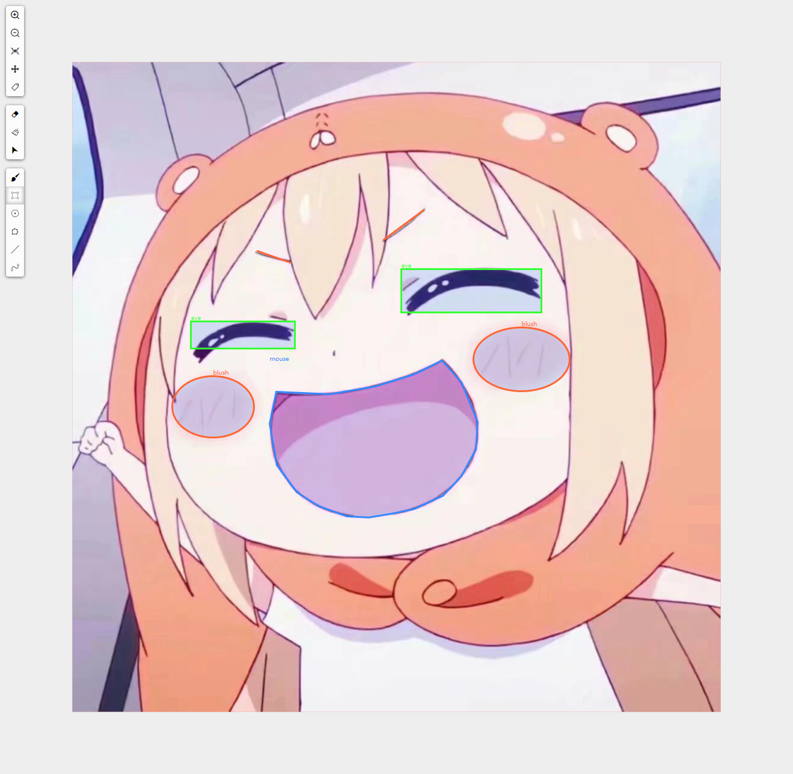

# image-marker

> A vue compoment that can draw graphs on image background

## display

### Attributes
| 参数      | 说明          | 类型      | 可选值                           | 默认值  |
|---------- |-------------- |---------- |--------------------------------  |-------- |
| imgSrc   | 底图src    | String | — | — |
| minScale | 最小缩放值 | Number | — | 0.5 |
| maxScale | 最大缩放值 | Number | — | 5 |
| stepScale | 缩放步长 | Number | — | 0.1 |
| mode     | 当前所处模式 | String | null/draw/editing/svgMoving/eraser | — |
| painterStyle | 画笔样式 | Object | — | — |
| graphData | 图形数据 | Array | — | [] |

### Events
| 事件名称 | 说明 | 回调参数 |
|---------- |-------- |---------- |
| imgOnload | 图片加载完成时触发的事件 | 图片的长度和宽度 |

